### Introduction

 “Space Impact” is a shooting game, which comes under the genre – ‘action’ and sub-genre – “shooter games” or “shoot em up games” or “shooting gallery games”. The game test the player's speed and reaction time. The purpose of a shooter game is to shoot opponents/asteroids and proceed through levels by destroying all the asteroids in the given amount of time and given number of bullets .

Characteristics of shooters:
* **Perspective**:The player views and controls the events from an overhead viewpoint and the shooter can be moved in the left or right direction along the horizontal axis using arrow keys.
* **Number of characteristics:** The game is a single player game with two modes.

Gameplay: The player has the ability to freely move a shooter horizontally using arrows keys . User shoots the bullet using up arrow key . Main aim of the game is to destroy all the asteroids in a particular level in given time. These asteroids are destroyed as soon  as a bullet touches them .  The game is made interesting by addition of many other features .
 The game can be played in two modes easy or advance mode.
In easy  mode asteroid stay in their own position and you just have to shoot them using given number of bullets.
In  advance mode asteroids are not stationary , they move about their position . You have to shoot them by guessing there new position. In advance mode too, there are a limited number of bullets for use.

If users destroy all the asteroids, he moves to next level with more number of asteroids and more time . User can virtually win infinite levels which continue as long as you want to play . Each levels brings a new challenge for user . More asteroids in each level means more fun .  

There are also five shooters from which you can choose of your choice . These shooters are Drone,UFO, tank , fighter airplane . All of them have their own body design and colour . But ability of each shooter to shoot is same .

There is an added feature of special power which activates itself in each level . User can use this special power if two or less asteroids are left in a level. This special power destroys all the left asteroids . But score of destroying those asteroids is not counted.

For fun we have included a cheat in the game . This ceat can be activated while playing the game . This cheat will activate special power which can be used at any time of the game .
Time challenge- Each level has its own level time . This level time increases with increase in levels. This time challenges creates an excitement for the user to use its reflexes as fast as it can to beat the time .

Score- We have adopted a very unique algorithm for our score . Score for destroying each asteroid is dependent on time on which it is destroyed and bullets left with user.

We have included different array of graphics functions in our program to make it more visually appealing and interesting . Bright colours are used which appeal to our eyes which creates a kind of attraction towards our game . Text size and font is adjusted in such a way that it makes users experience very easy in the game.

Objective of the project – Main objective of our project is for sole purpose of enjoyment . These kinds of game involve user in it .

Header Files Used:
1. iostream.h : used for standard input and output functions. (E.g. cin, cout)
2. time.h :used to declare variable ’t’ of type time for random number generator.
3. conio.h : for clrscr function and getch function.
4. stdlib.h : for puts and rand function.
5. graphics.h : used to implement graphics.
6. dos.h : for delay function.(to freeze the screen for specified time period)
7. stdio.h : for standard input and output function.
8. fstream.h : for text file handling.
9. math.h : used for using math function
10. string.h : used for different operations on string

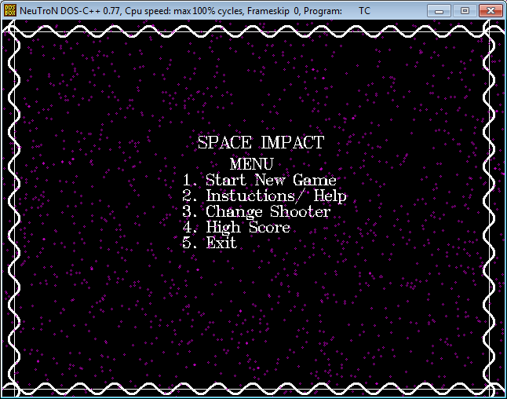
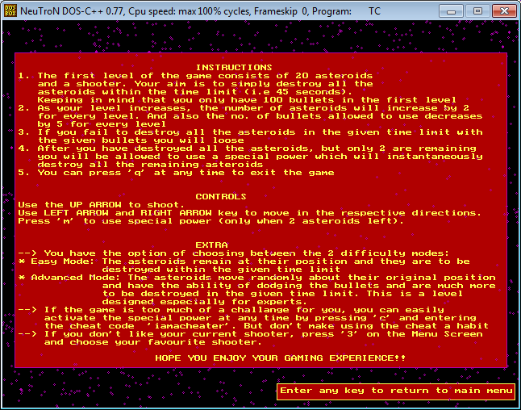
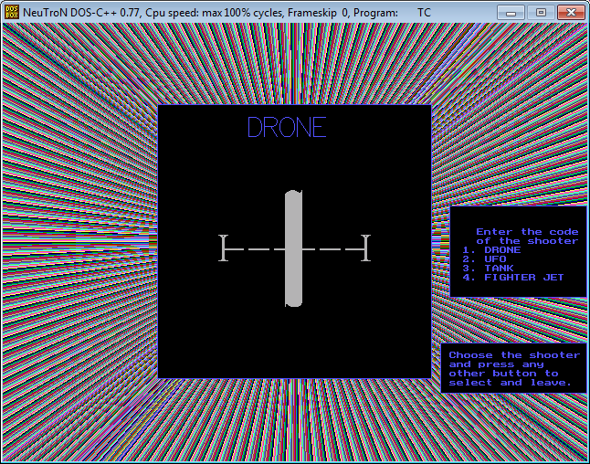
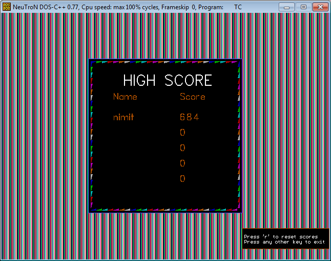
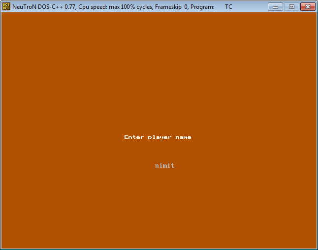
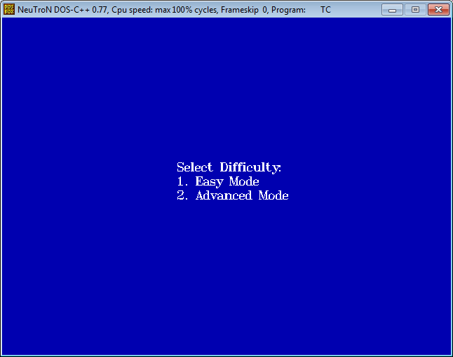
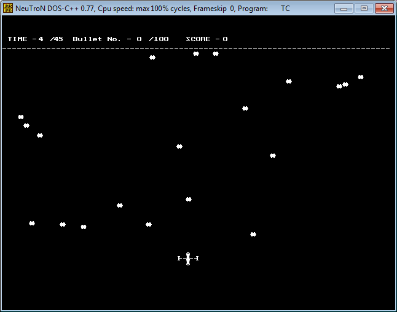
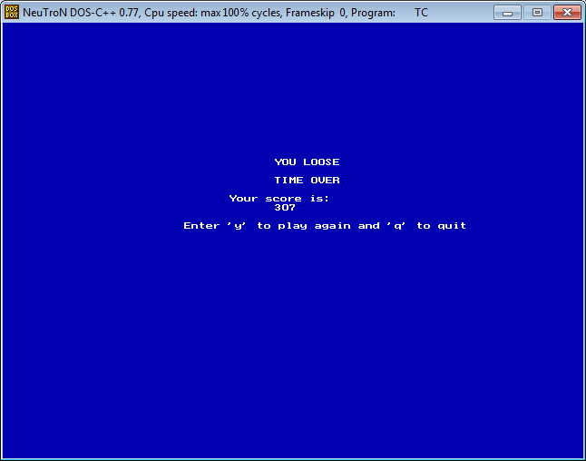
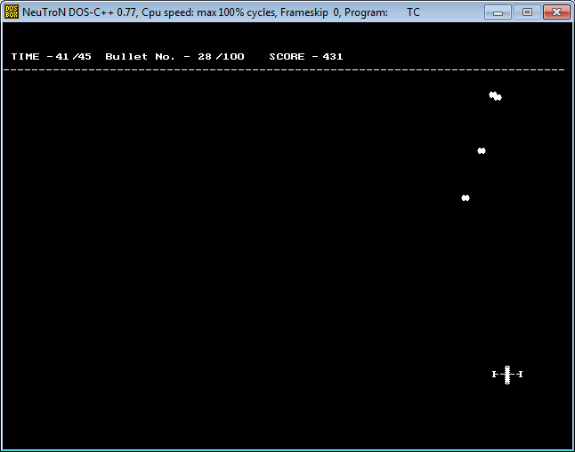
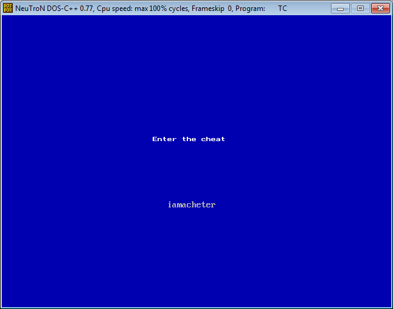
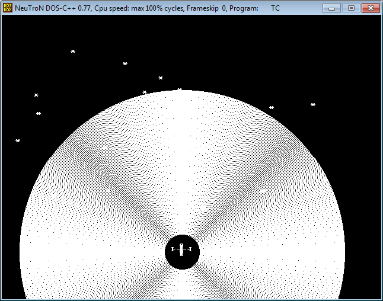
